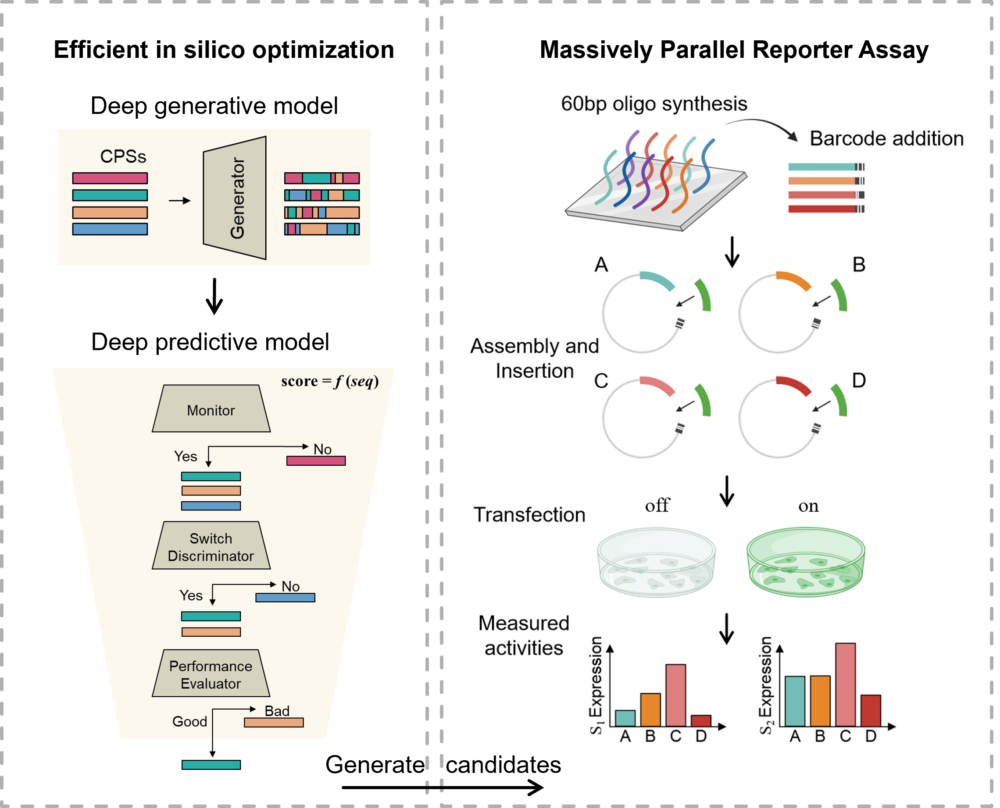

# DeepSwitch

*hyu edited on Nov 10, 2025*

The code for computational implementation of "Decoding the design logic of switch-like core promoters".

# Introduction

DeepSwitch is a deep learning–based framework that predicts core promoter activity and specificity and enables de novo design through multi-objective optimization. Using massively parallel reporter assays, we profile 48,000 natural and synthetic sequences in inducible and cell type-specific systems, uncovering regulatory grammar from single-base variants to motif combinations that drive switch-like transcriptional responses. Through iterative optimization, we engineer synthetic core promoters exhibiting up to 16-fold higher specificity than the commonly used miniCMV at comparable maximal output, maintaining robust performance across distinct systems.

# Preparation

## Environment Setup

This code requires a computer with a GPU to accelerate the training of deep learning models, otherwise it will take an extremely long time. 

**Env Requirements:** 
This code has been tested on the following version of env requirements:
- CUDA Version: 12.2
- Python 3.9.12
- PyTorch 1.12.1+cu116

Higher version of Python and Pytorch could also support the function of this package.

The function of this package depends on the following Python packages:
    numpy
    imblearn
    matplotlib
    pandas
    seaborn
    scikit-learn
    Levenshtein

## Dataset Preparation

The relevant training data is stored in the [Zenedo](https://zenodo.org/records/17567543). The following table conclude the function of these data.

| Name | Description|
| ------ | ------ |
| hg19.cage_peak_counts.osc.txt | Counts from CAGE-seq across 889 cell types
| hg19.cage_peak_tpm.osc | Expression levels (TPM) from CAGE-seq across 889 cell types
| Monitor_Dataset | Dataset for training the monitor to determine whether a sequence is a core promoter
| Switch discriminator_Dataset | Dataset for training the switch discriminator to evaluate whether a sequence has switch-like properties
| Performance evaluator_Dataset | Dataset for training the performance evaluator to evaluate the quality of a sequence’s switch properties
| MPRA_1st_library | Results from the first round of MPRA experiments
| MPRA_2nd_library | Results from the second round of MPRA experiments

# Design switch-like core promoter sequences

## Generation

The code in `1_DeepSwitch_model/MDM_switch.py` implements the MDM model deployed via GPro for efficient generation of switch-like sequences.

## Prediction

The code in `1_DeepSwitch_model/Monitor.py`, `1_DeepSwitch_model/Discriminator.py`, `1_DeepSwitch_model/Evaluator_strength.py`, and `1_DeepSwitch_model/Evaluator_specificity.py` is used to train the multi-layered predictive framework DeepSwitch.

## Optimization

The code in `1_DeepSwitch_model/DeepSwitch_MDM_design.py` integrates the outputs from the generation model and applies the predictive models to select optimal sequences.

# Other Information

The Zenodo repository for DeepSwitch [trained models and datasets](https://zenodo.org/records/17567543) have also been updated.

### Folder Structure and Contents
| Folder | Description |
|--------|-------------|
| `0_preprocessing` | Data preprocessing pipelines used for sequence filtering and evaluation in DeepSwitch |
| `1_DeepSwitch_model` | Implementation of predictive models for generation, evaluation, and optimization of switch-like sequences |
| `2_MOO_model` | Iterative multi-objective optimization framework for designing sequences in the second-round MPRA library |
| `3_other_analysis` | Tools for downstream analysis, visualization, and performance evaluation of experimental results |

# License

This code is released under the Creative Commons Attribution-NonCommercial 4.0 International (CC BY-NC 4.0) license. You are free to use, share, and adapt the code for non-commercial purposes. Any commercial use requires separate permission from the copyright holders.

# Citations

~~~

[1] Yu, H., & WangLabTHU. (2025). Decoding the design logic of switch-like core promoters. Zenodo. https://doi.org/10.5281/zenodo.17567543
~~~
