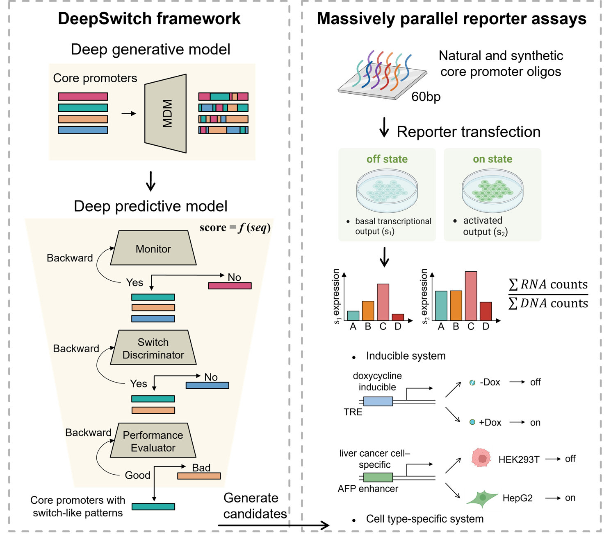

# DeepSwitch

*hyu edited on Nov 10, 2025*

The code for computational implementation of "A deep learning framework for designing switch-like core promoters".

# Introduction

DeepSwitch is a deep learning–based framework that predicts core promoter activity and specificity and enables de novo design through multi-objective optimization. Using massively parallel reporter assays, we profile 48,000 natural and synthetic sequences in inducible and cell type-specific systems, uncovering regulatory grammar from single-base variants to motif combinations that drive switch-like transcriptional responses. Through iterative optimization, we engineer synthetic core promoters exhibiting up to 16-fold higher specificity than the commonly used miniCMV at comparable maximal output, maintaining robust performance across distinct systems.


**Figure 1.** Overview of the DeepSwitch framework, including sequence generation, multi-layered prediction, iterative multi-objective optimization and massively parallel reporter assays.

# Quick Start

1. Clone the repository
2. Set up the environment
3. Run DeepSwitch sequence prediction

```
import pandas as pd
import torch
import torch.nn as nn
import numpy as np
import random
import pickle

# GPU or not
device = torch.device("cuda" if torch.cuda.is_available() else "cpu")


# Sequence to one-hot encoding
def sequences_to_one_hot(sequences):
    mapping = {'A': 0, 'T': 1, 'C': 2, 'G': 3}
    one_hot_sequences = [np.zeros((len(seq), len(mapping.keys()))) for seq in sequences]

    for i, seq in enumerate(sequences):
        for j, nucleotide in enumerate(seq):
            one_hot_sequences[i][j, mapping[nucleotide]] = 1

    return np.array(one_hot_sequences)


class CNNModel(nn.Module):
    def __init__(self, seq_len=100, kernel_sizes=5):
        super(CNNModel, self).__init__()
        self.conv1 = nn.Conv1d(in_channels=4, out_channels=128, kernel_size=(kernel_sizes,))
        self.conv2 = nn.Conv1d(in_channels=128, out_channels=64, kernel_size=(kernel_sizes,))
        self.conv3 = nn.Conv1d(in_channels=64, out_channels=32, kernel_size=(kernel_sizes,))
        self.pool = nn.MaxPool1d(kernel_size=2)
        self.lstm = nn.LSTM(32, 16, 1, batch_first=True, bidirectional=True)
        self.flatten = nn.Flatten()
        self.fc1 = nn.Linear(int((seq_len-kernel_sizes*3+3)*0.5)*32, 16)
        self.fc2 = nn.Linear(16, 1)

    def forward(self, x):
        # Convolution
        x = x.permute(0, 2, 1)
        x = nn.functional.relu(self.conv1(x))
        x = nn.functional.relu(self.conv2(x))
        x = nn.functional.relu(self.conv3(x))
        x = self.pool(x)

        # lstm
        x = x.permute(0, 2, 1)
        x, _ = self.lstm(x)

        # dense
        x = self.flatten(x)
        x = nn.functional.relu(self.fc1(x))
        x = self.fc2(x)
        x = torch.sigmoid(x)

        return x


class TwinTowerCNNModel(nn.Module):
    def __init__(self, seq_len=100, kernel_sizes=5):
        super(TwinTowerCNNModel, self).__init__()
        # Shared layers
        self.conv_shared1 = nn.Conv1d(in_channels=4, out_channels=256, kernel_size=kernel_sizes)
        self.bn_shared1 = nn.BatchNorm1d(256)
        self.conv_shared2 = nn.Conv1d(in_channels=256, out_channels=128, kernel_size=kernel_sizes)
        self.bn_shared2 = nn.BatchNorm1d(128)
        self.pool = nn.MaxPool1d(2)

        # Tower (-Dox)
        self.conv_m1_a = nn.Conv1d(in_channels=128, out_channels=64, kernel_size=kernel_sizes)
        self.bn_m1_a = nn.BatchNorm1d(64)
        self.conv_m2_a = nn.Conv1d(in_channels=64, out_channels=32, kernel_size=kernel_sizes)
        self.bn_m2_a = nn.BatchNorm1d(32)
        self.conv_m3_a = nn.Conv1d(in_channels=32, out_channels=1, kernel_size=4)

        # Tower (+Dox)
        self.conv_m1_b = nn.Conv1d(in_channels=128, out_channels=64, kernel_size=kernel_sizes)
        self.bn_m1_b = nn.BatchNorm1d(64)
        self.conv_m2_b = nn.Conv1d(in_channels=64, out_channels=32, kernel_size=kernel_sizes)
        self.bn_m2_b = nn.BatchNorm1d(32)
        self.conv_m3_b = nn.Conv1d(in_channels=32, out_channels=1, kernel_size=4)

        # Other layers
        self.flatten = nn.Flatten()
        self.relu = nn.ReLU()
        self.dropout = nn.Dropout(0.5)

    def forward(self, x):
        x = x.permute(0, 2, 1)

        # Shared layers
        x = self.conv_shared1(x)
        x = self.bn_shared1(x)
        x = self.relu(x)
        x = self.pool(x)

        x = self.conv_shared2(x)
        x = self.bn_shared2(x)
        x = self.relu(x)
        x = self.pool(x)

        # Tower (-Dox)
        x_a = self.conv_m1_a(x)
        x_a = self.bn_m1_a(x_a)
        x_a = self.relu(x_a)
        x_a = self.conv_m2_a(x_a)
        x_a = self.bn_m2_a(x_a)
        x_a = self.relu(x_a)
        x_a = self.conv_m3_a(x_a)
        x_a = self.flatten(x_a)
        x_a = self.dropout(x_a)

        # Tower (+Dox)
        x_b = self.conv_m1_b(x)
        x_b = self.bn_m1_b(x_b)
        x_b = self.relu(x_b)
        x_b = self.conv_m2_b(x_b)
        x_b = self.bn_m2_b(x_b)
        x_b = self.relu(x_b)
        x_b = self.conv_m3_b(x_b)
        x_b = self.flatten(x_b)
        x_b = self.dropout(x_b)

        return x_a, x_b


def model_predict(sequences):
    seq = torch.tensor(sequences_to_one_hot(sequences), dtype=torch.float32)
    batch_size = 40960

    # Switch Discriminator
    model = CNNModel(seq_len=60, kernel_sizes=5)
    model.to(device)
    model_state = torch.load('Models/best_discriminator.pth')
    model.load_state_dict(model_state)
    model.eval()

    pred_yes_no_list = []
    with torch.no_grad():
        for i in range(0, len(seq), batch_size):
            batch_seq = seq[i:i + batch_size].to(device)
            outputs = model(batch_seq)
            pred_yes_no = outputs.squeeze().detach().cpu().numpy().tolist()
            if not isinstance(pred_yes_no, list):
                pred_yes_no = [pred_yes_no]
            pred_yes_no_list.extend(pred_yes_no)

    # Evaluator
    model = TwinTowerCNNModel(seq_len=60, kernel_sizes=5)
    model.to(device)
    model_state = torch.load('Models/Natural_AI_two_tower_model.pth')
    model.load_state_dict(model_state)
    model.eval()

    Dox_minus_score_list = []
    Dox_plus_score_list = []
    with torch.no_grad():
        for i in range(0, len(seq), batch_size):
            batch_seq = seq[i:i + batch_size].to(device)
            outputs_a, outputs_b = model(batch_seq)

            dox_minus_score = outputs_a.squeeze().detach().cpu().numpy().tolist()
            if not isinstance(dox_minus_score, list):
                dox_minus_score = [dox_minus_score]
            Dox_minus_score_list.extend(dox_minus_score)

            dox_plus_score = outputs_b.squeeze().detach().cpu().numpy().tolist()
            if not isinstance(dox_plus_score, list):
                dox_plus_score = [dox_plus_score]
            Dox_plus_score_list.extend(dox_plus_score)

    # Switch identification
    probability_final = [[], []]
    for i in range(len(pred_yes_no_list)):
        if pred_yes_no_list[i] < 0.5:
            probability_final[0].append(0)
            probability_final[1].append(0)
        else:
            probability_final[0].append(Dox_minus_score_list[i])
            probability_final[1].append(Dox_plus_score_list[i])

    # Monitor
    model = CNNModel(seq_len=60, kernel_sizes=5)
    model.to(device)
    model_state = torch.load('Models/best_monitor.pth')
    model.load_state_dict(model_state)
    model.eval()

    pred_out_of_dis = []
    with torch.no_grad():
        for i in range(0, len(seq), batch_size):
            batch_seq = seq[i:i + batch_size].to(device)
            outputs = model(batch_seq)
            out_of_dis_score = outputs.squeeze().detach().cpu().numpy().tolist()
            if not isinstance(out_of_dis_score, list):
                out_of_dis_score = [out_of_dis_score]
            pred_out_of_dis.extend(out_of_dis_score)

    #   CP identification
    for i in range(len(pred_out_of_dis)):
        if pred_out_of_dis[i] < 0.5:
            probability_final[0][i] = 0
            probability_final[1][i] = 0

    final_total_score = [(a + b)/2 for a, b in zip(probability_final[0], probability_final[1])]

    return {
        'monitor_pred': pred_out_of_dis,
        'discriminator_pred': pred_yes_no_list,
        'dox_minus_score': Dox_minus_score_list,
        'dox_plus_score': Dox_plus_score_list,
        'probability_final': final_total_score
    }
    

if __name__ == '__main__':
    # Dataset Load
    Sequences = ['CAAAAAGATAAGCTTTACCTATAAAAGGACCTTTCGTTGCTGTCTGGTTGTGTGTGGAAC',
                 'GGGAGATGGGCTCTGAGACTATAAAGCCAGCGGGGGCCCAGCAGCCCTCAGCCCTCCAGG'

    ]
    all_predictions = model_predict(Sequences)
    df = pd.DataFrame({
        'sequence': Sequences,
        'monitor_pred': all_predictions['monitor_pred'],
        'discriminator_pred': all_predictions['discriminator_pred'],
        'dox_minus_score': all_predictions['dox_minus_score'],
        'dox_plus_score': all_predictions['dox_plus_score'],
        'probability_final': all_predictions['probability_final']
    })
    
    df.to_csv('predictions.csv', index=False)
    print("Save succeed !")
```

An example of the expected output is provided in the saved file predictions_backup.csv

# Preparation

## Environment Setup

This code requires a computer with a GPU to accelerate the training of deep learning models, otherwise it will take a long time. 

**Env Requirements:** 
This code has been tested on the following version of env requirements:
- CUDA Version: 12.2
- Python 3.9.12
- PyTorch 1.12.1+cu116

Higher version of Python and Pytorch could also support the function of this package.

The function of this package depends on the following Python packages:
    numpy
    imblearn
    matplotlib
    pandas
    seaborn
    scikit-learn
    Levenshtein

## Dataset Preparation

The relevant training data is stored in the [Zenedo](https://zenodo.org/records/17567543). The following table conclude the function of these data.


| Name | Description|
| ------ | ------ |
| hg19.cage_peak_counts.osc.txt | Counts from CAGE-seq across 889 cell types
| hg19.cage_peak_tpm.osc | Expression levels (TPM) from CAGE-seq across 889 cell types
| Monitor_Dataset | Dataset for training the monitor to determine whether a sequence is a core promoter
| Switch discriminator_Dataset | Dataset for training the switch discriminator to evaluate whether a sequence has switch-like properties
| Performance evaluator_Dataset | Dataset for training the performance evaluator to evaluate the quality of a sequence’s switch properties
| MPRA_1st_library | Results from the first round of MPRA experiments
| MPRA_2nd_library | Results from the second round of MPRA experiments


# Design switch-like core promoter sequences

## Generation

The code in `1_DeepSwitch_model/MDM_switch.py` implements the MDM model deployed via GPro for efficient generation of switch-like sequences.

## Prediction

The code in `1_DeepSwitch_model/Monitor.py`, `1_DeepSwitch_model/Discriminator.py`, `1_DeepSwitch_model/Evaluator_strength.py`, and `1_DeepSwitch_model/Evaluator_specificity.py` is used to train the multi-layered predictive framework DeepSwitch.

## Optimization

The code in `1_DeepSwitch_model/DeepSwitch_MDM_design.py` integrates the outputs from the generation model and applies the predictive models to select optimal sequences.

# Other Information

The Zenodo repository for DeepSwitch [trained models and datasets](https://zenodo.org/records/17567543) have also been updated.

### Folder Structure and Contents
| Folder | Description |
|--------|-------------|
| `0_preprocessing` | Data preprocessing pipelines used for sequence filtering and evaluation in DeepSwitch |
| `1_DeepSwitch_model` | Implementation of predictive models for generation, evaluation, and optimization of switch-like sequences |
| `2_MOO_model` | Iterative multi-objective optimization framework for designing sequences in the second-round MPRA library |
| `3_other_analysis` | Tools for downstream analysis, visualization, and performance evaluation of experimental results |


# License

This code is released under the Creative Commons Attribution-NonCommercial 4.0 International (CC BY-NC 4.0) license. You are free to use, share, and adapt the code for non-commercial purposes. Any commercial use requires separate permission from the copyright holders.

# Citations

~~~

[1] Yu, H., & WangLabTHU. (2025). Decoding the design logic of switch-like core promoters. Zenodo. https://doi.org/10.5281/zenodo.17567543
~~~
